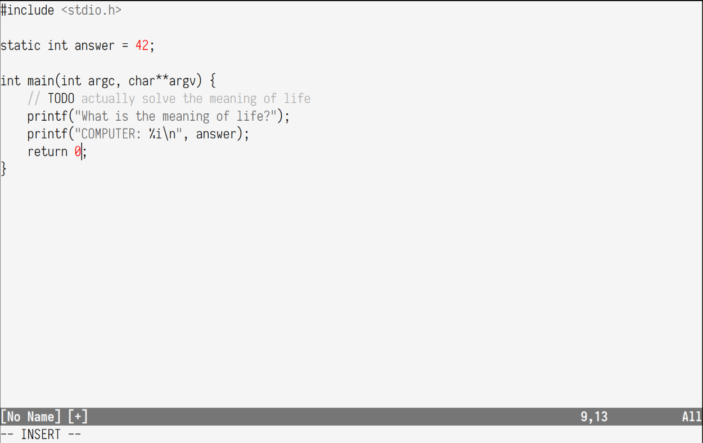
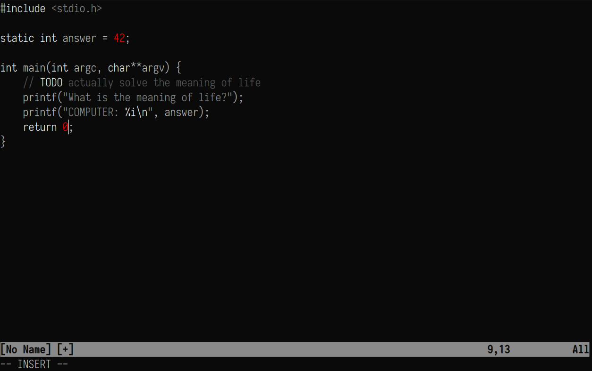

<div id="header">
    <p align="center">
      <b>simple-light</b><br>
	  <span font-size="16px">a simple light grayscale theme</span><br>
      <span font-size="12px">Inspired by <a href="http://tek256.com">Devon</a> with love.</span><br>
      <span font-size="12px">Forked from <a href="https://github.com/tek256/simple-dark">Devon</a> with love.</span><br>
    </p>
</div>



### About  
Simple Light is a colorscheme aimed at being easy to read and focus with. The goal is to write with as few distractions as possible!

### Installation
For vim you can do the following:  
If you're using something like vim plug you can simply add 
```
Plugin 'omakk/simple-grayscale'
```
and run `:PlugInstall` to make sure the scheme is downloaded.

otherwise you can just copy the `colors` folder to your vim colors folder (usually `~/.vim/colors/`).

Once you have the scheme just adding either of the variants as colorscheme looks like
```
colorscheme simple-dark
```
or
```
colorscheme simple-light
```
